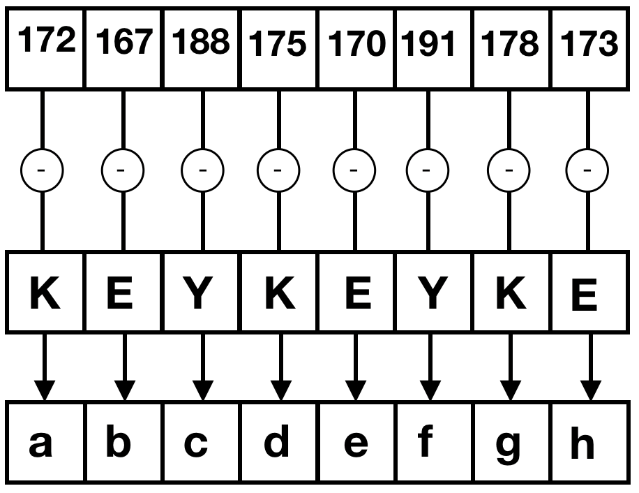

# Spring99-CA1
Advanced Programing Course First Computer Assignment

## SarBaste

SarBaste is a simple stream chiper which use two methods for encrypting or decrypting streams.

### Simple Method 
In this method each character of input file added to key characters sequentially. 

`Encryption Example:`


`Decryprion Example:`




### Complicated Method
This method like other simple stream ciphers use a psudo random generator to generate key for each characters specifically.


`Encryption Example:`


`Decryprion Example:`


## How to Run?

At first, you should make executable file from code. 

```
g++ --std=c++11 main.cpp -o sarbaste.out
```

Then you can run this executable and perform input like this : 
```
./sarbaste.out
encrypt/decrypt
simple/complicated
<inputFilePath>
<outputFilePath>
```
For example : 
```
./sarbaste.out
encrypt
simple
./input.txt
./output.txt
```

### Authors
Code and Project Description : 


[Farzad Habibi](farzadhabibi.ir)
